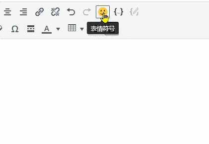
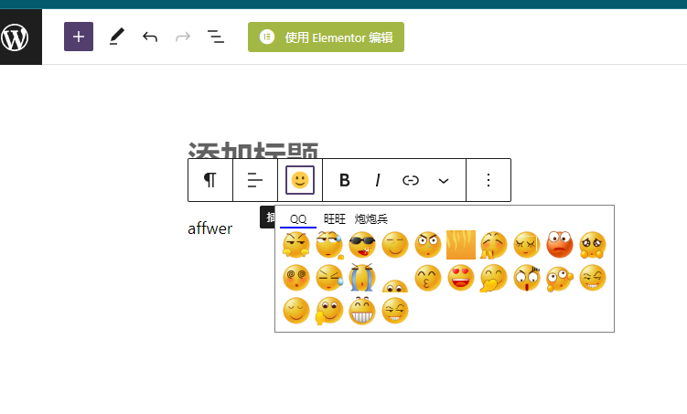
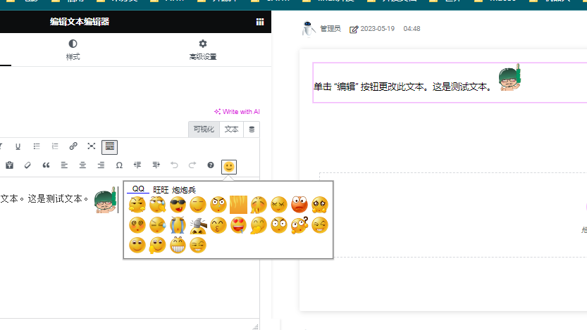

# 让Wordpress方便添加表情图片(是图片)
# To make it easy to add emoji images (which are actual images) in Wordpress.

支持TinyMCE经典编辑器,新版本中的块编辑器,Elementor中的文本编辑器.

To support the TinyMCE classic editor, the block editor in the new version, and the text editor in Elementor.

------------------

经典编辑器

Classic Editor

------------------

块编辑器

Block Editor

------------------

Element文本编辑器

Element Text Editor

# 可以自己添加图片到image文件夹中(二级文件夹)
Of course, you can add your own images to the "image" folder (in a sub-folder).

该插件修改自:http://wordpress.org/extend/plugins/tinymce-smiley-button/
